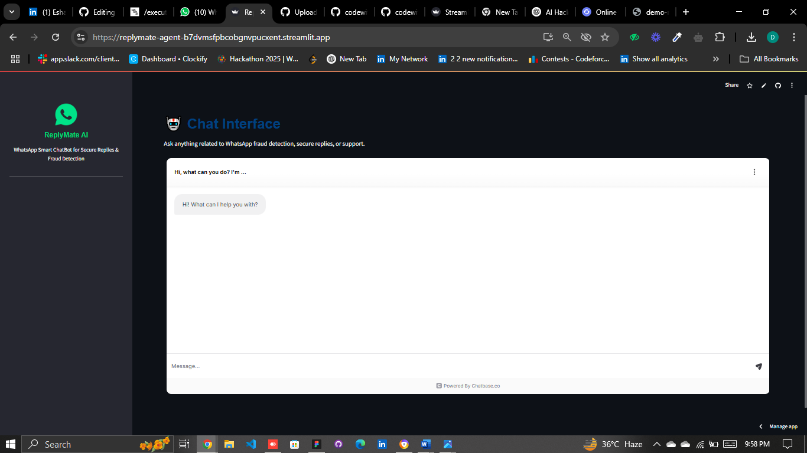

# 🤖 **ReplyMate AI Agent**

<!-- Demo GIF -->


**Built by Aptiva AI for the lablab.ai Hackathon 2025**

**ReplyMate AI Agent** is a real-time conversational intelligence system that enables secure, automated communication with built-in fraud detection and contextual memory. It’s designed for businesses that value smart, responsive, and ethical AI-powered messaging.

---

## 🚀 **Features**
- **AI-powered Responses** using GPT-4o  
- **Fraud Detection** with hybrid rule-based + LLM techniques  
- **Smart Context Memory** via LangChain and Redis  
- **Multi-Platform Messaging** (WhatsApp Business API, Webchat, Email)  
- **Real-Time Backend** with FastAPI / Node.js  
- **Frontend Dashboard** built using React.js  
- **Scalable Databases** using MongoDB and PostgreSQL  
- **Revisit Consent Button** to let users update data-sharing preferences anytime  

---

## 🧠 **Tech Stack**

| Frontend   | Backend           | AI/NLP             | Infra & Database           |
|------------|-------------------|--------------------|-----------------------------|
| React.js   | FastAPI / Node.js | GPT-4o, LangChain  | Redis, MongoDB, PostgreSQL |

---
📜 𝐕𝐞𝐫𝐢𝐟𝐢𝐞𝐝 𝐂𝐞𝐫𝐭𝐢𝐟𝐢𝐜𝐚𝐭𝐞 : https://lnkd.in/d9i2pjr2
---
## 👥 Team Aptiva AI

| Name                   | Role                         | GitHub                                               |
|------------------------|------------------------------|----------------------------------------------------------------|
| **Deepak Kumar**       | Software Design Engineer(ME) | [Deepak-tekchandani](http://github.com/Deepak-tekchandani) |
| **Eesha Tariq**        | AI Engineer                  | [codewithEshaYoutube](https://github.com/codewithEshaYoutube) |
| **Zeeshan Tariq**      | Data Scientist               | [zeeshantariqpkn](https://github.com/zeeshantariqpkn) |
| **Ramspheld Onyango**  | Python Developer             | [RamspheldOnyangoOchieng](https://github.com/RamspheldOnyangoOchieng) |
| **Najma Razzaq**       | Data Scientist               | [najmarazzaq761](https://github.com/najmarazzaq761) |
| **Muhammad Ehtisham**  | Software Engineer            | [Ehtisham3397](https://github.com/Ehtisham3397) |


## 📽️ **Demo & Presentation**

### **Demo Video:**
<div style="text-align:center; width:100%; max-width:800px; margin:auto; border: 2px solid #ccc; padding: 10px;">
  
</div>

---

### **Chat Interface:**
<div style="text-align:center; width:350px; height:250px; border: 2px solid #ccc; padding: 10px;">
  
</div>

---
## 🧠 Technologies Used

ReplyMate AI Agent is built using a modern, open-source-centric tech stack designed for real-time, secure, and intelligent AI communication systems.

### 🔹 Frontend
- **React.js**  
  A powerful JavaScript library used for building the dashboard and user-facing components. It enables dynamic rendering, state management, and seamless integration with APIs.  
  ✅ Open-source

### 🔹 Backend
- **FastAPI**  
  A high-performance Python web framework used for serving AI models, API routing, and backend logic.  
  ✅ Open-source

- **Node.js**  
  Used for handling additional backend microservices, particularly integration with messaging APIs like WhatsApp.  
  ✅ Open-source

### 🔹 AI / NLP
- **GPT-4o (OpenAI)**  
  The core LLM (Large Language Model) powering ReplyMate's intelligent and contextual responses. While OpenAI is proprietary, the integration logic and how it's called is customizable.

- **LangChain**  
  An open-source framework for chaining LLM calls and maintaining smart memory between user sessions. This helps in generating responses that consider prior messages.  
  ✅ Open-source

### 🔹 Real-Time Context Memory
- **Redis**  
  In-memory data store used for caching conversation states, user sessions, and memory embeddings to allow real-time updates and responsiveness.  
  ✅ Open-source

### 🔹 Databases
- **MongoDB**  
  NoSQL database for storing chat histories, user profiles, feedback, and logs.  
  ✅ Open-source

- **PostgreSQL**  
  Used for structured data such as configuration settings, audit logs, and team permissions.  
  ✅ Open-source

### 🔹 Fraud Detection System

ReplyMate AI includes a **hybrid fraud detection system** combining:

- **Rule-Based Logic**:  
  Custom-defined rules such as keyword filtering, blacklist checking, and frequency analysis. For example, repetitive requests for personal data or financial details can trigger warnings.

- **LLM-Based Analysis (using GPT-4o)**:  
  Suspicious messages are also passed through an LLM prompt with zero-shot classification prompts to evaluate intent and context. This provides semantic-level fraud detection.

- **Scoring System**:  
  Every message receives a fraud score based on rule matches and LLM evaluation. Messages exceeding a threshold are flagged or auto-replied with a warning.

- **Consent-Aware Blocking**:  
  Users can revisit their consent through the **"Revisit Consent"** feature to manage data-sharing and report abuse proactively.

---

---

## 🔗 Live Demo, Submission & Repository

- 🚀 **Live Web App:**  
  [ReplyMate AI - Streamlit Deployment](https://replymate-agent-b7dvmsfpbcobgnvpucxent.streamlit.app/)

- ✅ **Lablab.ai Submission:**  
  [ReplyMate AI — AI Genesis Hackathon by Aptiva AI](https://lablab.ai/event/execute-ai-genesis/aptiva-ai/replymate-ai)

- 🧑‍💻 **GitHub Repository:**  
  [https://github.com/Deepak-tekchandani/ReplyMate-Agent](https://github.com/Deepak-tekchandani/ReplyMate-Agent)

---


## 🧪 **How to Run**

```bash
# Clone the repository
git clone https://github.com/YourRepo/ReplyMate-AI-Agent.git
cd ReplyMate-AI-Agent

# Backend setup
cd backend
pip install -r requirements.txt
uvicorn main:app --reload

# Frontend setup
cd ../frontend
npm install
npm start

